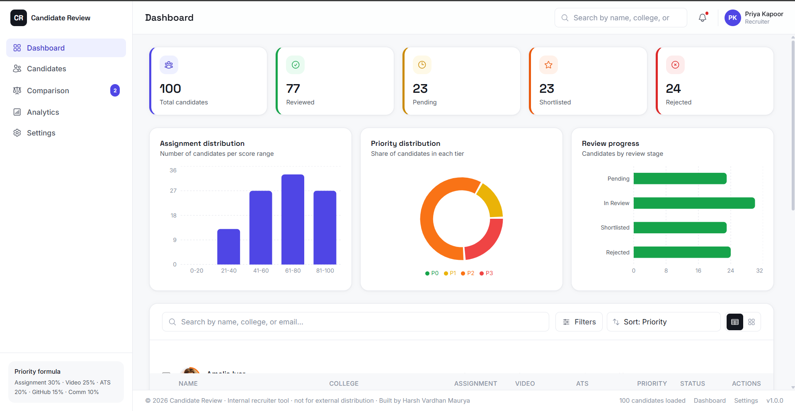
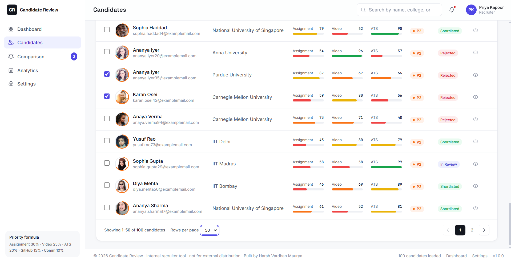
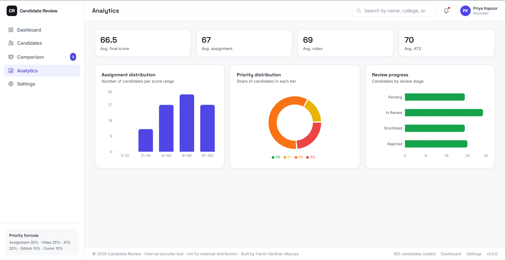

# 🚀 Candidate Review Dashboard

> A production-ready internal recruiter dashboard built with **React 19**, **Vite**, and **Tailwind CSS** to streamline candidate review, evaluation, prioritization, and comparison.

Designed with a modern SaaS interface inspired by **Linear**, **Vercel**, **Notion**, and the **Stripe Dashboard**, this project focuses on clean architecture, reusable components, scalable state management, and an intuitive user experience.

---


## 📸 Screenshots

### Dashboard Overview



---

### Candidate Table



----

### Analytics Dashboard



---

## 🎥 Demo Video

👉 **Click below to watch the demo:**

[▶️ Watch Demo Video](./Screenshot/demo.mp4)

---

# ✨ Features

## 📊 Dashboard Overview

Provides recruiters with a quick overview of the hiring pipeline.

- 👥 Total Candidates
- ✅ Reviewed
- ⏳ Pending
- 🌟 Shortlisted
- ❌ Rejected

Each summary card includes:

- Modern icons
- Color-coded status
- Hover animations
- Responsive layout

---

## 🔍 Smart Search

Search candidates instantly using a **500ms debounced search**.

Search by:

- Name
- Email
- College

---

## 🎯 Advanced Filtering

Filter candidates using multiple criteria.

Available filters:

- Assignment Score
- Video Score
- ATS Score
- Priority
- Review Status
- College

---

## 📈 Dynamic Sorting

Sort candidates by:

- Priority
- Assignment Score
- Video Score
- ATS Score
- Newest
- Oldest

---

## 👨‍💻 Candidate Table

Responsive candidate table featuring:

- Avatar
- Name
- College
- Assignment Score
- Video Score
- ATS Score
- Priority
- Review Status
- Actions

Additional Features:

- Sticky Header
- Pagination
- Responsive Layout
- Hover Effects
- Avatar Fallback
- Skeleton Loading
- Empty State

---

## 📄 Candidate Profile Drawer

Selecting a candidate opens a detailed profile drawer.

Includes:

- Personal Information
- Contact Details
- College & Degree
- Skills & Experience
- Resume
- GitHub
- LinkedIn
- Review Status
- Submission Date

Score Overview:

- Assignment
- Video
- ATS
- GitHub
- Communication

Responsive behavior:

- Right-side drawer (Desktop)
- Fullscreen drawer (Mobile)

---

## 📝 Assignment Evaluation

Interactive evaluation sliders.

Criteria:

- UI Quality
- Component Structure
- State Management
- Edge Case Handling
- Responsiveness
- Accessibility

Features:

- Slider (0–100)
- Automatic Average Score
- Real-time Updates

---

## 🎥 Video Evaluation

Evaluate interview videos using:

- Confidence
- Communication
- Architecture Explanation
- Tradeoff Discussion
- Problem Solving

Additional Features:

- Timestamp Notes
- Add Notes
- Edit Notes
- Delete Notes

---

## ⚡ Automatic Priority Engine

Candidate priority updates automatically whenever evaluation scores change.

### Formula

```text
Final Score =
Assignment × 30%
+ Video × 25%
+ ATS × 20%
+ GitHub × 15%
+ Communication × 10%
```

| Priority | Score | Recommendation |
|----------|-------|----------------|
| 🟢 P0 | 90–100 | Interview Immediately |
| 🟡 P1 | 75–89 | Strong Shortlist |
| 🟠 P2 | 60–74 | Review Later |
| 🔴 P3 | Below 60 | Reject |

---

## ⚖️ Candidate Comparison

Compare up to **three candidates** side-by-side.

Comparison includes:

- Assignment Score
- Video Score
- ATS Score
- GitHub Score
- Communication Score
- Final Priority

Highest values are highlighted automatically.

---

## 📊 Analytics Dashboard

Interactive charts built with **Recharts**.

Includes:

- Assignment Score Distribution
- Priority Distribution
- Review Progress
- Overall Candidate Statistics

---

## 📱 Responsive Design

Optimized for:

- Desktop
- Tablet
- Mobile

Features:

- Responsive Sidebar
- Mobile Navigation
- Adaptive Table
- Fullscreen Drawer

---

## ✨ Modern User Experience

- Framer Motion Animations
- Smooth Transitions
- Hover Effects
- Skeleton Loading
- Rounded Cards
- Soft Shadows
- Glassmorphism Elements

---

## 🛡 Error Handling

Gracefully handles:

- Missing Data
- Empty Candidate Lists
- Broken Avatar URLs
- Unknown Priority
- Empty Search Results
- Empty Comparison Selection

---

# 📂 Project Structure

```text
src/
├── components/
│   ├── Dashboard/
│   ├── CandidateTable/
│   ├── CandidateDrawer/
│   ├── Charts/
│   ├── Layout/
│   ├── common/
│   ├── SearchBar.jsx
│   ├── Filters.jsx
│   ├── SortMenu.jsx
│   └── ComparisonModal.jsx
│
├── context/
│   └── CandidateContext.jsx
│
├── hooks/
│   ├── useCandidates.js
│   └── usePriority.js
│
├── utils/
│   ├── priorityEngine.js
│   ├── helpers.js
│   └── constants.js
│
├── data/
│   └── candidates.json
│
├── App.jsx
├── main.jsx
│
└── scripts/
    └── generateCandidates.mjs
```

---

# 🛠 Tech Stack

| Technology | Purpose |
|------------|---------|
| React 19 | Frontend Framework |
| Vite | Build Tool |
| Tailwind CSS | Styling |
| React Context API | State Management |
| React Icons | Icons |
| Recharts | Charts |
| Framer Motion | Animations |
| Local JSON | Data Storage |

---

# 🚀 Getting Started

### Install Dependencies

```bash
npm install
```

### Start Development Server

```bash
npm run dev
```

### Build for Production

```bash
npm run build
```

### Preview Production Build

```bash
npm run preview
```

### Run ESLint

```bash
npm run lint
```

### Generate Candidate Data

```bash
node scripts/generateCandidates.mjs
```

---

# 🏗 Architecture

- CandidateContext manages global application state.
- useCandidates handles search, filtering, sorting, and pagination.
- usePriority calculates candidate priority dynamically.
- priorityEngine.js implements the weighted scoring algorithm.
- Reusable UI components ensure scalability and maintainability.

---

# 🌐 Deployment

This project can be deployed on:

- Vercel
- Netlify
- GitHub Pages
- Firebase Hosting
- AWS S3 + CloudFront

Build Command:

```bash
npm run build
```

Deploy the generated **dist/** folder.

---

# 👨‍💻 Author

**Harsh Vardhan Maurya**

Frontend Developer specializing in **React, JavaScript, and modern UI development**.

This project demonstrates clean architecture, reusable components, responsive design, scalable state management with React Context API, and production-quality frontend engineering practices.
